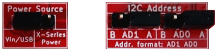
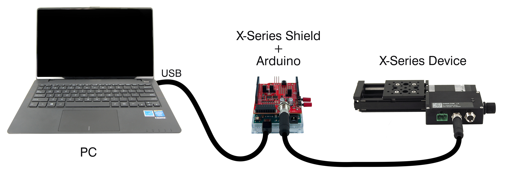

# Zaber ASCII Library for Arduino

## Contents
1. [Quick Start Guide](#quick-start-guide)
1. [More Details](#more-details)
1. [Looking for Binary support?](#looking-for-binary-support)

## Quick Start Guide

We recommend using [Zaber's X-series Shield](https://www.zaber.com/products/accessories/X-AS01).
If you don't have one and you prefer to use a more basic RS-232 shield with some adapters, you
can get started [here](documentation/Zaber ASCII Library for Arduino.md#appendix-b-getting-started-without-zabers-x-series-shield).

### Install

1. Download and install the [Arduino IDE](https://www.arduino.cc/en/Main/Software).
1. Open the Arduino IDE, and navigate to `Sketch -> Include Library -> Manage Libraries...`
1. Within the window that opens, search within the `Filter your search...` box for "Zaber".
1. Click on each library that shows up, then click the `Install` button.


### Configure



1. On your [X-series Shield](https://www.zaber.com/products/accessories/X-AS01), put your Power Source jumper in the "Vin/USB" position.  This ensures that your Zaber device does not try to power the shield.
1. Choose address `AA` with the I2C Address jumpers.

### Connect



1. Connect the X-series Shield (X-AS01) to your Arduino. Don't connect other shields just yet.
1. Connect your Zaber device to the X-series Shield with a data cable:
   [X-DC](https://www.zaber.com/products/accessories/X-DC02) for X-series,
   [S-XDC](https://www.zaber.com/products/accessories/S-XDC) for A-series, and
   [T-XDC](https://www.zaber.com/products/accessories/T-XDC) for T-series devices.
1. Power your Zaber device.
1. Connect your Arduino to your computer with a USB cable. The "ON" LED should light up on the X-series Shield.

### Compile & Run

1. When you are ready to begin programming, open the Arduino Integrated Development Environment
  (IDE). The following example will home a device in the ASCII protocol with 115200 baud rate. Copy
  and paste it into the Arduino IDE.
1. Select your Arduino board type and port (see the [Arduino IDE documentation](https://www.arduino.cc/en/Guide/ArduinoUno#toc5)).
1. Save and upload the sketch (with the right-pointing arrow at the top of the screen).

```c
/* Getting started with Arduino and Zaber devices - ASCII */

#include <ZaberAscii.h>

ZaberShield shield(ZABERSHIELD_ADDRESS_AA);
ZaberAscii za(shield);

void setup() {
    /* Initialize baudrate to 115200, typical for Zaber ASCII devices */
    shield.begin(115200);

    /* Issue a home command to device 1 */
    za.send(1, "home");

    /* Always read the reply to a command even if not checking for errors. */
    /* This helps avoid serial port receive buffer overruns and message corruption. */
    za.receive();

    /* Wait for the move command to finish moving. */
    za.pollUntilIdle(1);

    /* Additional commands can now be issued */
}

void loop() {

}
```

Click the upload button (the right-pointing arrow at the top of the screen), and watch your device move
to the home position.

## More details

Check out the [In-Depth Beginner's Guide](documentation/Zaber ASCII Library for Arduino.md#zaber-ascii-library-for-arduino)
for troubleshooting, additional programs and documentation.

## Looking for Binary support?

Zaber devices use two protocols: ASCII and Binary. This library only supports the ASCII protocol.
If you would prefer to use the Binary protocol, there is a separate library also available
through the Arduino IDE Library Manager, or
[here](https://gitlab.com/zaber-core-libs/zaber-binary-for-arduino#zaber-binary-library-for-arduino)
