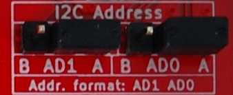

# Zaber ASCII Library for Arduino

## Contents
1. [Downloading Zaber's Libraries for Arduino](#downloading-zabers-libraries-for-arduino)
1. [In-Depth Beginner's Guide](#in-depth-beginners-guide)
   + [Connecting Your Zaber Device to an Arduino Board](#connecting-your-zaber-device-to-an-arduino-board)
   + [Writing Code - The Arduino IDE](#writing-code-the-arduino-ide)
   + [Simple ASCII Homing Example](#simple-ascii-homing-example)
   + [Intermediate ASCII Example](#intermediate-ascii-example)
   + [Using the Serial Monitor to Debug Your Code](#using-the-serial-monitor-to-debug-your-code)
   + [Interpreting Replies](#interpreting-replies)
   + [Adding More Shields and Sensors](#adding-more-shields-and-sensors)
1. [My Program Isn't Working!](#my-program-isnt-working)
1. [Additional Example Programs](#additional-example-programs)
1. [Appendix A: Using the Rugged I/O Interface](#appendix-a-using-the-rugged-io-interface)
1. [Appendix B: Getting Started Without Zaber's X-Series Shield](#appendix-b-getting-started-without-zabers-x-series-shield)
1. [Documentation](#documentation)

## Downloading Zaber's Libraries for Arduino

1. Download and install the [Arduino IDE](https://www.arduino.cc/en/Main/Software).
1. Open the Arduino IDE, and navigate to `Sketch -> Include Library -> Manage Libraries...`
1. Within the window that opens, search within the `Filter your search...` box for "Zaber".
1. Click on each library that shows up, then click the `Install` button.


## In-Depth Beginner's Guide

This tutorial walks you through the details of setting up simple functional examples.  For a crash
course on getting a minimal example working on your Arduino, you can also see the
[Quick Start Guide](../README.md#Contents).

### Connecting Your Zaber Device to an Arduino Board

Arduino boards are like tiny computers, but they can only run one program at a time. This makes them
inexpensive and useful tools for prototyping, testing, or in this case, interacting with motors.

Zaber devices communicate with Arduino boards via serial communications. This means that a RS-232 serial
communications port and cable is necessary to connect the Arduino to a Zaber device. Zaber recommends
the [X-Series Shield](https://www.zaber.com/products/accessories/X-AS01) which lets you talk to Zaber
devices and to your debug Serial Monitor at the same time. If you're interested in using additonal
serial ports for other devices, it's easiest to invest in a larger platform like the
[Arduino Mega](https://store.arduino.cc/usa/mega-2560-r3).

To complete this beginner's guide you will need:
- A Zaber device
- An Arduino Uno Rev3 or Mega Rev3 board
- A USB cable to plug the Arduino into your PC (this should come with the Arduino)
- An [X-Series Shield](https://www.zaber.com/products/accessories/X-AS01) for the Arduino
- A [X-DC data cable](https://www.zaber.com/products/accessories/X-DC02) to connect the Zaber device
  and the X-Series Shield
  * A-Series and T-Series devices will instead require an [S-XDC](https://www.zaber.com/products/accessories/S-XDC)
    or a [T-XDC](https://www.zaber.com/products/accessories/T-XDC), respectively

The X-Series Shield allows you to power your Arduino from your Zaber X-Series device, which is useful
when you have finished your program and want to run without being connected to the computer. For now
though, it's best to power the Arduino over USB.
- Make sure your Power Source jumper is in the "Vin/USB" position.

Zaber's X-Series Shield uses I2C to communicate with the Arduino. For most cases, the default address
`AA` will work.  If you plan on using other shields that also use I2C, make sure you choose a unique I2C
address for each shield.  See [Adding More Shields and Sensors](#adding-more-shields-and-sensors).

1. Connect the X-Series Shield (X-AS01) to your Arduino.
1. Connect your Zaber device to the X-Series Shield with the correct data cable.
1. Power your Zaber device.
1. Connect your Arduino to your computer with a USB cable. The "ON" LED should light up on the X-Series Shield.


### Writing Code - The Arduino IDE

Arduino programs are compiled and uploaded to an Arduino board using the Arduino IDE, available
[here](https://www.arduino.cc/en/Main/Software) for download. Once the Arduino IDE is installed and open
on your computer, you should be presented with a screen similar to as follows:


This is where all C++ code is written and compiled for Arduino boards. Code that is present in
the `setup()` function will be run once, when the Arduino initially boots the program. Code that
is present in the `loop()` function is called repeatedly, so long as the Arduino board has power and the
program has not halted execution.

Before trying to run any Arduino program, you must tell the Arduino IDE what type of Arduino you have and
which port it is connected to on your computer. Refer to the 
[Arduino IDE documentation](https://www.arduino.cc/en/Guide/ArduinoUno#toc5).

----

### Simple ASCII Homing Example

This section will show you the process of creating a simple program step by step, with explanation of
the concepts. If you would prefer to jump directly to a complete program, you can open one of our
provided examples in the Arduino IDE by navigating the menus to `File -> Examples -> Zaber ASCII`, where
the completed example below is available as `Basic_Homing`.

For now, let's write a simple program: When the Arduino turns on, we'll send the attached Zaber device
back to its home position. As this command only needs to be issued once and not repeatedly, we can
utilize the `setup()` function in this case, leaving the `loop()` function empty.

#### Initializing Zaber's Libraries for Arduino

If your device is in Binary mode, you will need to switch it to ASCII first. You can use 
[Zaber Console](https://www.zaber.com/wiki/Software/Zaber_Console#Options_Tab) to change your device's 
mode of operation. Under its Options tab there is a button to quickly change all devices between the ASCII 
and Binary protocols. For the sake of this example, we will assume that the device is in ASCII mode.

The first thing to do is import the `ZaberAscii` library at the very top of your file.

>>>
**Common Questions**

_What is a library?_

A library is a group of predefined functions that are distributed together. Importing the library allows 
us to utilize its functions for our own program.

_What is a function?_

A function is a short section of code that is named. It can be run from multiple places in a program
using its name, to avoid duplicating the same code many times.

_How do I know what functions are available?_

In the example code below, "ZaberAscii.h" refers to a file that is distributed with the library,
which you can open to see function declarations. Typically libraries include these .h files that you can
refer to if other reference documentation is not available. This library does not include
separate function reference documentation, so please refer to [ZaberShield.h](ZaberShield.h) and
[ZaberAscii.h](ZaberAscii.h). On a Windows PC, the typical installed location of these files is 
`Documents\Arduino\libraries\ZaberAscii`. The reference for functions provided by Arduino can be 
found [here](https://www.arduino.cc/reference/en/).

>>>

Create a new file in the Arduino IDE and add this line at the top:

```c
#include <ZaberAscii.h>
```

#### Creating an Instance

Now, we need to initialize an instance of the `ZaberAscii` class. When doing so, a
[Serial class](https://www.arduino.cc/reference/en/language/functions/communication/serial/) must be
passed through to the constructor. A Serial class controls communication with the Zaber device through
serial ports. For all Arduino boards, the basic `Serial` class is available, as all
Arduino boards possess at least one serial port. However, if your Arduino board has more than one
serial port, the classes `Serial1`, `Serial2`, `Serial3` are additionally available, allowing
simultaneous control with non-Zaber devices, or debug-printing. The Zaber X-Series Shield requires
the use of a different serial class called ZaberShield, which is provided in the library.

First we'll define and initialize an instance of the ZaberShield class. This instance needs to be
provided with information about the address jumper setting on the board.

```c
#include <ZaberAscii.h>

ZaberShield shield(ZABERSHIELD_ADDRESS_AA);
```

>>>
**Common Questions**

_What is an instance and why do I need one?_

Our name `shield` is an instance of our `ZaberShield` class, initialized using the a numeric
constant that sets the address to use. This instance is a section of memory used to store a copy of the
`ZaberShield` class's data and which lets us utilize all of the functions of the class. We could 
potentially create other instances of `ZaberShield`, giving them each a different name, and each would
keep track of its own internal state independently.

_What is a class?_

A class is a group of zero or more pieces of data and the functions that operate on that data. Classes
make code conceptually more like real-world objects by grouping behavior and data together, and are
the core concept of object-oriented programming.

_What is a constructor?_

A constructor is a method that is called when we want to create an instance. The parameters passed
into the constructor are what create the instance. In our case, we construct `shield` with
`ZABERSHIELD_ADDRESS_AA` as a parameter to the constructor.

_What does initialization mean?_

Initialization means setting the initial state of an instance. For numeric data this is just 
assigning its first value. For class instances this means calling the constructor, which is in turn 
responsible for initializing the internal data of the class.

_What is a global variable?_

A global variable is one that can be accessed anywhere in the program - it has the highest scope,
declared at the top of a file in order to allow all nested functions access to it. In the example
above, `shield` is a global variable. Examples of variables that are not globel are those that
are declared inside a class or inside a function.
>>>

The above code configures a global variable named `shield` to be an instance of the ZaberShield serial
port class using port address 0x90. The name `ZABERSHIELD_ADDRESS_AA` is one of four constants that are
defined in the library for this purpose, when names ending in `AA`, `AB`, `BA`, and `BB`. The first letter
in these constant names suffixes corresponds to the AD1 jumper position, and the second letter corresponds
to the AD0 jumper position. You must use the constant that matches the jumper setting on your shield.



The port address is configured using jumpers on the Zaber shield. The address is configurable in order
to make it possible to avoid conflict with other shields that want to use a given address for another
purpose.


Next, we'll define the instance of the `ZaberAscii` class as a global variable named `za`, and pass in the
shield class we created above.

Note in the incremental code examples below, changes are highlighted with comments saying "this line is new".
You don't need to include those comments in your code.

```c
#include <ZaberAscii.h>

ZaberShield shield(ZABERSHIELD_ADDRESS_AA);
ZaberAscii za(shield);  // <-- This line is new.
```

#### Setting the Baudrate

Now that a ZaberAscii instance has been initialized, it is important to set and match the baudrate to the 
device. Zaber X-Series devices, by default, use a baudrate of `115200`. Let's initialize the ZaberShield 
class with this baudrate in the `setup()` function, to be called at startup:

```c
#include <ZaberAscii.h>

ZaberShield shield(ZABERSHIELD_ADDRESS_AA);
ZaberAscii za(shield);

void setup() {
    /* Initialize baudrate to 115200, typical for Zaber ASCII devices */  // <-- This line is new.
    shield.begin(115200);                                                 // <-- This line is new.
}
```

#### Issuing a Command to the Zaber Device

With all of the serial communications setup out of the way, we can now send commands to the device.
Commands are sent to a ZaberAscii instance with the `send(int deviceNumber, String command, long int data)`
function. The parameters of this function are as follows:

- The `int deviceNumber` can be found by looking in Zaber Console, but is by default `1` for new devices.
  It is the address of the device in a series of devices all connected to the same serial port, and
  if you have multiple devices on the same port you must configure them to each have a different number.
  Additionally, issuing a command with `deviceNumber = 0` will send the command to all devices.
- The various `String command` values available can be found by looking at the
  [Zaber ASCII Protocol Manual](https://www.zaber.com/protocol-manual). For this
  example, we'll use the `"home"` command.
- Finally, if a command string requires data to be sent (for example, the distance for the device to
  move), the data can be passed through the `long int data` parameter. Note that this parameter is optional,
  and if a command string does not require additional data to be sent, it can be ignored.

>>>

**Common Questions**

_What is a parameter?_

Code functions, like mathematical functions, can be parameterized and can return results. Parameters
(also called arguments) are data that you give to a function when you call it. The code inside
the function may make use of that data in order to determine what to do, or as part of its internal
calculations.

>>>

Let's issue the home command to our device number 1 using the predefined home command string, right
after setting the baudrate. This command does not require any data to be passed through.

```c
/* Issue a home command to device 1 */
za.send(1, "home");
```

In most cases, when you send a command to a device, you should read its reply - even if you don't use
the reply for anything. If you do not read the reply, it will wait in the Arduino's serial port receive
buffer until you do try to read a reply. If you don't read every reply, you can end up reading
the reply to a previous command by accident, or the receive buffer can overflow causing you to read
corrupted replies. The `receive()` function will read one reply. In this example we read and ignore the
reply by not assigning the function's return value to a variable:

```c
/* Always read the reply even if not checking it for errors. */
za.receive();
```

Your code should now look as follows:

```c
#include <ZaberAscii.h>

ZaberShield shield(ZABERSHIELD_ADDRESS_AA);
ZaberAscii za(shield);

void setup() {
    /* Initialize baudrate to 115200, typical for Zaber ASCII devices */
    shield.begin(115200);

    /* Issue a home command to device 1 */                           // <-- This line is new.
    za.send(1, "home");                                              // <-- This line is new.

    /* Always read the reply even if not checking it for errors. */  // <-- This line is new.
    za.receive();                                                    // <-- This line is new.
}

void loop() {

}
```

#### Compiling and Running the Program On Your Arduino Board

You are now ready to run the program. Plug in your Arduino board via the USB connector to your PC, and set
the following options:

- Under "Tools", check that the correct port is selected (you should see your Arduino board name by the
  port number in brackets)
- Under "Tools", set "Board" to the appropriate board that you have (this should be the same as the board
  name you saw in brackets when selecting a port)

Now, click the upload button (the right-facing arrow next to the checkmark button at the top of the IDE)
to compile and upload the program to your Arduino board. The program should run as soon as it has been
uploaded, and send the home command to the Zaber device, if you have the device connected to your
Zaber shield.

----

### Intermediate ASCII Example

If you'd like, you can follow along with this guide to learn about how the program is written;
alternatively, you can navigate within the Arduino IDE to `File -> Examples -> Zaber ASCII`, and click
on the `Intermediate_LED` example to load the completed code into the Arduino IDE.

Perhaps you are working overnight, and you only want to monitor devices that are not currently at their
home position. The devices that are at their home position are not currently in use, but are still
receiving power, and you'd like a way to differentiate them from the devices that are receiving power
but not in their home positions. Using our Arduino knowledge, we can write a fairly simple script to
fix this problem.

We'll start our program as before, creating an instance of the Zaber Ascii class, and initializing the
baudrate to 115200 in the `setup()` function:

```c
#include <ZaberAscii.h>

ZaberShield shield(ZABERSHIELD_ADDRESS_AA);
ZaberAscii za(shield);

void setup() {
    /* Initialize baudrate to 115200, typical for Zaber ASCII devices */
    shield.begin(115200);
}

void loop() {

}
```

Next, we'll query for the device's position in the loop function. This function runs continuously until
the Arduino loses power or the program halts. This way, by checking if the device's position is `0`, we
can turn the device's LED lights on or off. First, send the request for the position of the device.

```c
#include <ZaberAscii.h>

ZaberShield shield(ZABERSHIELD_ADDRESS_AA);
ZaberAscii za(shield);

void setup() {
    /* Initialize baudrate to 115200, typical for Zaber ASCII devices */
    shield.begin(115200);
}

void loop() {
    /* Issue a get position command to the device */           // <-- This line is new.
    za.send(1, "get pos");                                     // <-- This line is new.
}
```

Next, we'll want to receive and analyze the response. This can be done using the `receive` function, which
returns a `reply` struct. A response from the Zaber ASCII library takes the form of a `struct reply`.
You can see the declatation of the reply struct in [ZaberAscii.h](ZaberAscii.h).
See the [Interpreting Replies](#interpreting-replies) section for more information about responses.

>>>

**Common Questions**

_What is a struct?_

A struct (short for "structure") is a container for multiple pieces of data, like a class.
Unlike a class, structs usually do not contain functions. There are also differences between how 
structs and classes are copied to new variables by the equals sign.

>>>

For now, store the reply from the device into a local variable.

```c
#include <ZaberAscii.h>

ZaberShield shield(ZABERSHIELD_ADDRESS_AA);
ZaberAscii za(shield);

void setup() {
    /* Initialize baudrate to 115200, typical for Zaber ASCII devices */
    shield.begin(115200);
}

void loop() {
    /* Issue a get position command to the device */
    za.send(1, "get pos");

    /* Create a variable to store the device response inside */     // <-- This line is new.
    ZaberAscii::reply posResponse = za.receive();                   // <-- This line is new.
}
```

We only want the data from the response, as it contains the device's position from our issued
"get pos" command. This will be in the `long int responseData` variable of the `reply` struct. Thus,
we use an `if` statement on the variable to check whether it is `0`, or any other value.

```c
#include <ZaberAscii.h>

ZaberShield shield(ZABERSHIELD_ADDRESS_AA);
ZaberAscii za(shield);

void setup() {
    /* Initialize baudrate to 115200, typical for Zaber ASCII devices */
    shield.begin(115200);
}

void loop() {
    /* Issue a get position command to the device */
    za.send(1, "get pos");

    /* Create a variable to store the device response inside */
    ZaberAscii::reply posResponse = za.receive();

    /* Check if the device is currently at the home position */    // <-- This line is new.
    if (posResponse.responseData == 0)                             // <-- This line is new.
    {                                                              // <-- This line is new.
                                                                   // <-- This line is new.
    }                                                              // <-- This line is new.
    else                                                           // <-- This line is new.
    {                                                              // <-- This line is new.
                                                                   // <-- This line is new.
    }                                                              // <-- This line is new.
}
```

Finally, we can issue a command to turn the LED lights off if the device is in the home position. If the
device is not at the home position (inside the `else{}`), we want to continue to monitor the device, and
thus turn the LED lights on.

```c
#include <ZaberAscii.h>

ZaberShield shield(ZABERSHIELD_ADDRESS_AA);
ZaberAscii za(shield);

void setup() {
    /* Initialize baudrate to 115200, typical for Zaber ASCII devices */
    shield.begin(115200);
}

void loop() {
    /* Issue a get position command to the device */
    za.send(1, "get pos");

    /* Create a variable to store the device response inside */
    ZaberAscii::reply posResponse = za.receive();

    if (posResponse.responseData == 0)
    {
        /* Set the device's LED lights to OFF if it is at home */          // <-- This line is new.
        za.send(1, "set system.led.enable", 0);                            // <-- This line is new.
    }
    else
    {
        /* Set the device's LED lights to ON */                            // <-- This line is new.
        za.send(1, "set system.led.enable", 1);                            // <-- This line is new.
    }

    /* Always read the reply, even if not using it. */                     // <-- This line is new.
    /* Since each of the if/else blocks above only sends one */            // <-- This line is new.
    /* command, we can read either reply outside the blocks, here. */      // <-- This line is new.
    za.receive();                                                          // <-- This line is new.
}
```

You can now upload this program to your Arduino, and you'll notice that any device that is at the home
position will have its power LED lights and communication LED lights turned off. If you move the device
away from the home position (using one of the knobs) you'll see the LED lights turn back on, ready to be
monitored.

---

### Using the Serial Monitor to Debug Your Code

One of the advantages of using the X-Series Shield to connect to your Arduino is that the X-Series Shield does
not use up serial ports on the Arduino.  This lets you print out debug information on the Serial Monitor at
the same time as communicating with Zaber devices.  Building on the previous example:

```c
#include <ZaberAscii.h>

ZaberShield shield(ZABERSHIELD_ADDRESS_AA);
ZaberAscii za(shield);

void setup() {
    /* Initialize baudrate to 115200, typical for Zaber ASCII devices */
    shield.begin(115200);

    /* Initialize Arduino's serial port for debugging */                   // <-- This line is new.
    Serial.begin(9600);                                                    // <-- This line is new.
}

void loop() {
    /* Issue a get position command to the device */
    za.send(1, "get pos");

    /* Create a variable to store the device response inside */
    ZaberAscii::reply posResponse = za.receive();

    if (posResponse.responseData == 0)
    {
        /* Set the device's LED lights to OFF if it is at home */
        za.send(1, "set system.led.enable", 0);

        /* Send a debug message to the Serial Monitor */                   // <-- This line is new.
        Serial.print("Position: 0 (homed!)\t");                            // <-- This line is new.
        Serial.println("LED should be OFF");                               // <-- This line is new.
    }
    else
    {
        /* Set the device's LED lights to ON */
        za.send(1, "set system.led.enable", 1);

        /* Send a debug message to the Serial Monitor */                   // <-- This line is new.
        Serial.print("Position: ");                                        // <-- This line is new.
        Serial.print(posResponse.responseData);                            // <-- This line is new.
        Serial.println("\t\tLED should be ON");                            // <-- This line is new.
    }

    /* Always read the reply, even if not using it. */
    /* Since each of the if/else blocks above only sends one */
    /* command, we can read either reply outside the blocks, here. */
    za.receive();

    /* Add a delay to limit polling to 2 times per second */               // <-- This line is new.
    delay(500);                                                            // <-- This line is new.
}
```

Let's now upload the program to your Arduino and open the Serial Monitor in the Arduino IDE. You
can do this either by clicking `Tools -> Serial Monitor`, or using the `Ctrl+Shift+M` shortcut.
Make sure your baud rate is set to 9600 to match the code.  Assuming your serial port is still
configured properly in the IDE, you should see printouts similar to the one below, updating about
twice per second.


You can also try to use the Serial Plotter (`Tools -> Serial Plotter`, or `Ctrl+Shift+L`) to
graphically follow your device's position.

----

### Interpreting Replies

Some additional comments about how to interpret device replies. As mentioned earlier, the `reply`
data structure contains the following fields:

- `String fullResponse`: The entire unparsed response String
- `bool isReply`: Evaluates to `true` if the response is a reply
- `int deviceNumber`: Evaluates to the device number that the command response is in relation to
- `int axisNumber`: Evaluates to the axis number that the command response is in relation to
- `bool isRejected`: Returns `true` if the command was rejected by the device
- `bool isBusy`: Returns `true` if the device was busy and could not receive the command
- `bool hasWarning`: Returns `true` if the command presented a warning from the device
- `String warningFlags`: A string containing the warning flags if a warning was issued
- `String responseDataString`: The data attached to the response in a String variable
- `long int responseData`: The data attached to the response in a Integer variable

If you want to be sure you are examining the correct reply to a command, you should check that the
`deviceNumber` matches the device you expected to get a message from, and that `isReply` is true.
If `isReply` is false, it means you have either an alert or an info message - you will have to check
the first character of `fullResponse` to determine which if you want to handle these message types.
Alerts start with '!' and info messages start with '#'.

Before using the data in a reply, you should make sure the command executed successfully. Check
`isRejected` to make sure the device didn't refuse the command, and check `isBusy` to see if the
device is currently moving or not. You can use the `isIdle` or `pollUntilIdle` methods of the
`ZaberAscii` class to check for moving/idle status without having to interpret this data yourself.

For most commands that return a data value, the `responseData` field will give you the value in
numeric form. There are some cases where you will want to parse the data yourself from the
`responseDataString` field though - in cases where the returned data has a decimal place, multiple
values, numbers too large to fit in a 32-bit signed integer, or non-numeric data.

The `hasWarning` and `warningFlags` fields indicate whether the device is reporting a warning state.
Whether or nor a flag indicates a condition you should care about depends on which flags are present
and on your usage context. Check the
[warning flags](https://www.zaber.com/protocol-manual#topic_message_format_warning_flags)
section of the Zaber ASCII protocol manual for interpretation. Also be aware that multiple
warnings can be active at once, but a reply normally only contains the most urgent one. You can
use the "warnings" command to retrieve of all of them.

See the "Track Manual Moves" example program for some basic examples of interpreting reply conditions
and also another way to avoid blocking your program while waiting for replies.

---

### Adding More Shields and Sensors

It's a good idea to power everything down before connecting any new hardware.  Consider the
following when adding to your setup.

1. **I2C Address:** if any of your other shields also use I2C to communicate with the
   Arduino...
   - Choose a unique address for the X-Series Shield from the following four options:
     - I2C address AA: 0x90
     - I2C address AB: 0x92
     - I2C address BA: 0x98
     - I2C address BB: 0x9A
   - If you change the address, you must power cycle the board for it to take effect. A simple reset won't work.
   - Make sure the address in your code (`ZABERSHIELD_ADDRESS_xx`), which is specified in the initialization of
   the `ZaberShield` class, matches your jumper settings.

1. **Power Source:** once you're happy with your code, you can disconnect your Arduino from the computer
   and power it from an X-Series Zaber device!
   - At this point, you can switch the Power Source jumper to the "X-Series Power" position.
   - If you want to still supply power to your Arduino via the barrel jack power input or the Vin pin, you
     must leave the jumper in the "Vin/USB" position!

1. **Ruggedized I/O:** if you want a bit of protection for the extra signals you're connecting, read
   [this Appendix](#appendix-a-using-the-rugged-io-interface).

## My Program Isn't Working!

**The program won't upload to the Arduino board**

- Check your Port and Board settings under `Tools -> Board:` and `Tools -> Port:`.
- If you are using the Zaber X-Series Shield, ensure that the shield is powered. The ON led in the bottom
  right corner should be lit. Make sure your Power Source jumper agrees with your wiring.
- If you are using a non-Zaber RS-232 shield, make sure the shield is turned off. If your RS-232 shield
  does not have an on/off switch, simply remove it when uploading to the Arduino. Remember to turn it
  back on after your program is uploaded.

**The device isn't recognizing my commands or seems to be moving/reacting randomly**

- Make sure that you are using the correct protocol and baudrate. By default, X-Series devices are in
  ASCII, 115200 baudrate, and T- and A-series devices are in Binary 9600 baudrate (except the A-MCB2).
  You can check the protocol and baudrate in Zaber Console, and switch between the two protocols using
  the options tab. [Zaber Console](https://www.zaber.com/wiki/Software/Zaber_Console#Options_Tab)
  provides easy accessibility to changing your device's protocol under its Options tab. Also confirm
  you are sending the correct commands. In the ASCII protocol, commands are identified as strings,
  such as "get pos" - the full list of commands for the
  ASCII protocol can be found [here](https://www.zaber.com/protocol-manual#topic_commands).

**I am not getting the replies I expect or there are too many replies**

- Make sure you are reading every response returned by each device. In most cases Zaber devices send
  one response for each command they receive, and treating them this way is usually sufficient for basic
  use.
- Under certain conditions, devices can send spontaneous messages that are not replies to commands;
  in the ASCII protocol, you can configure the device to send an
  [alert](https://www.zaber.com/protocol-manual#topic_message_format_alerts) message when a condition
  is met, and some commands will append multiple
  [info](https://www.zaber.com/protocol-manual#topic_message_format_info) messages to their replies.
  The Zaber library does not automatically handle these spontaneous messages, so if you are working
  with devices that may generate them, you should check for them when reading replies and recognize
  that they do not count as the expected reply to your last command.

**The device is making high-pitched beeping noises whenever it moves**

Contact Zaber support at [contact@zaber.com](mailto:contact@zaber.com) to ensure that your device was
configured correctly.

**These fixes didn't work for me and my program still won't run**

Contact Zaber support at [contact@zaber.com](mailto:contact@zaber.com), detailing your Arduino board type,
Zaber device model, Zaber or RS-232 shield type, and the Arduino code that refuses to run.

## Additional Example Programs

More example programs are accessible through the Arduino IDE. Use the menu sequence 
`File -> Examples -> Zaber ASCII` to find all of the example programs included with this library.
Each example contains comments explaining what it does.

## Appendix A: Using the Rugged I/O Interface

We have chosen to ruggedize some of the Arduino's inputs and outputs and expose the protected signals on
the black terminal block. They are not bulletproof, but going a couple volts outside of your Arduino's supply
voltage will no longer kill your Arduino. We recommend using the protected terminal block inputs/outputs
whenever possible, but you can always connect directly to the pin headers to get default Arduino bevavior.

The ruggedized interface gives you access access to the following functions:
- two analog inputs<sup>†</sup> (A0 and A1)
- three PWM outputs (digital pins 3, 5 and 6)
- four digital inputs or outputs (digital pins 3-6)
- +5V, which is limited to 150mA and will disable if you draw more current

<sup>†</sup>The max analog value that protected analog inputs can read is 1020 out of 1024.


To connect to this connector, simply push your wire into the round hole. Spring-loaded clamps will hold
it in place.

To remove your wire, push into the narrow hole above the wire with the small slotted screwdriver that
came with your X-Series Shield.

For more details, take a look at the [X-AS01 hardware overview](https://www.zaber.com/products/accessories/X-AS01/overview).

## Appendix B: Getting Started Without Zaber's X-Series Shield

If you do not have our recommended [X-Series Shield](https://www.zaber.com/products/accessories/X-AS01):

1. Mount the [an RS-232 shield](https://www.dfrobot.com/product-1030.html) on top of the Arduino and plug
the Arduino board in to your computer using the provided USB cable.
1. To connect the Zaber device to the RS-232 shield, you will first need to convert the female DSUB9
into a Male DSUB9 using a null
[M/M adapter](https://www.monoprice.com/Product?c_id=104&cp_id=10416&cs_id=1041603&p_id=1202&seq=1&format=2).
1. If you are using a T- or A- series Zaber device, you will also need the
[T-DSUB9 adapter](https://www.zaber.com/products/product_accessories.php?detail=T-DSUB9). If you are using
an X-Series device, you will need the X-SDC cable. When uploading to the Arduino, ensure the RS-232
converter is OFF (switch located on the top). Note that T-series Zaber devices do not support the
ASCII protocol; if you want to control a T-series device with an Arduino, you must use the
[Zaber Binary library for Arduino](https://gitlab.com/zaber-core-libs/zaber-binary-for-arduino).
1. Use the Serial class in your code instead of the ZaberAscii class. It has all of the same methods but does not
need the port address passed to its constructor.

## Documentation

Schematics for Zaber's X-Series Shield and a short hardware reference can be found
[here](https://www.zaber.com/products/accessories/X-AS01).

Documentation for all of Zaber's library for Arduino can be found in the [ZaberShield.h](../ZaberShield.h)
and [ZaberAscii.h](../ZaberAscii.h) files. On a Windows PC, the typical installed location of these
files is `Documents\Arduino\libraries\ZaberAscii`.
